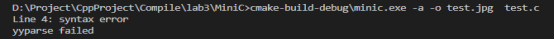

[TOC]

- [前言](#前言)
- [词法分析](#词法分析)
  - [💠识别Token](#识别token)
  - [💠屏蔽注释](#屏蔽注释)
  - [💠跳过空格和换行符](#跳过空格和换行符)
  - [💠错误处理](#错误处理)
- [语法分析](#语法分析)
  - [💡改造后的MiniC文法](#改造后的minic文法)
  - [💡处理优先级和结合性](#处理优先级和结合性)
  - [💡构建抽象语法树（AST）](#构建抽象语法树ast)
  - [💡处理语法糖](#处理语法糖)
  - [💡检查语法错误](#检查语法错误)
  - [💡生成代码注释](#生成代码注释)
- [语义分析](#语义分析)
  - [🎓类型检查](#类型检查)
  - [🎓符号表管理](#符号表管理)
  - [🎓作用域分析](#作用域分析)
  - [🎓函数调用检查](#函数调用检查)
  - [🎓错误处理](#错误处理-1)
- [中间代码生成](#中间代码生成)
  - [⌛构建中间表示](#构建中间表示)
  - [⌛表达式转换](#表达式转换)
  - [⌛控制流转换和短路求值](#控制流转换和短路求值)
  - [⌛符号表处理](#符号表处理)
  - [⌛常量和临时变量处理](#常量和临时变量处理)
  - [⌛优化](#优化)
  - [⌛错误处理](#错误处理-2)
- [代码优化](#代码优化)
  - [🔎去除冗余代码](#去除冗余代码)
  - [🔎减少函数调用](#减少函数调用)
  - [🔎循环优化](#循环优化)
  - [🔎常数折叠](#常数折叠)
  - [🔎变量复用](#变量复用)
  - [🔎数据流分析](#数据流分析)
  - [🔎硬件指令优化](#硬件指令优化)
  - [🔎并行优化](#并行优化)
- [基本块划分及控制流图](#基本块划分及控制流图)

## 前言

这是一个可写进简历的课程作业。

参考:

[南大的编译原理实验课](https://github.com/three-water666/MiniC/)

## 词法分析

### 💠识别Token

词法分析器需要遍历输入的源代码，识别出其中的Token，本项目中使用**Flex**工具进行词法分析。Token是源代码中的最小语法单元，可以是关键字、标识符、运算符、常量等。

🔸 关键字

&emsp;&emsp;MiniC文法里面的关键字有：int , void, if, else, return, break, continue, while, for(后加的)

🔸 标识符

&emsp;&emsp;标识符必须以字母a-z、 A-Z或下划线开头，后面可跟任意个(可为0)字符，这些字符可以是字母、下划线和数字

&emsp;&emsp;标识符最大长度为256

```yacas
[a-zA-Z_]([a-zA-Z0-9_])*
```

<div align="center", >

<p >图1 识别标识符</p>
</div>

🔸 运算符

&emsp;&emsp;支持的运算有

&emsp;&emsp;二元运算：+,-,*,/,%

&emsp;&emsp;一元运算: -(取负), ++, --

&emsp;&emsp;逻辑运算: &&, ||, !

&emsp;&emsp;关系运算: >, <, >=, <=, ==, !=

🔸 常量

  🔹 十进制整数

  ```yacas
  [1-9][0-9]*|0
  ```

  🔹 十六进制整数

  ```yacas
  0(x|X)[0-9a-fA-F]+
  ```

  🔹 八进制整数

  ```yacas
  0[0-7]+
  ```

  由于文法暂不支持浮点数，所以这里就不写浮点数的识别

### 💠屏蔽注释

词法分析器需要屏蔽注释，以便后续的处理程序忽略注释。

MiniC中支持两种注释

```c
// 单行注释

/*
多行注释
*/
```

### 💠跳过空格和换行符

词法分析器需要跳过输入中的空格和换行符，在Token之间建立正确的分隔符。

### 💠错误处理

词法分析器需要处理输入中的错误，并在出现错误时向后续的处理程序报告错误信息。

```c
int main()
{
 int a, b, c;
 a = -1.5;
 return t;
}
```

错误信息

```bash
Line 5: Invalid num 1.5, Only supports integers 
Line 5: syntax error
yyparse failed
```

## 语法分析

### 💡改造后的MiniC文法

高层定义，包括全局变量的定义int a,b;和函数的定义 int main();

```yacas
Input     : program
program   : segment |  program segment
segment   : type def                        // 全局变量或者函数名定义或声明
type      :  T_INT | T_VOID
def       :  ident idtail                   // 全局变量或者函数名定义
/* 定义的具体内容 */
idtail    : deflist                         // 变量定义,第一个不是数组 int a,b[2],c;
          | varrdef deflist                 // 变量定义,第一个是数组   int a[2],b;
          | '=' expr deflist                // 变量初始化,int a=1,b;
          | '(' paras ')' functail          // 有参函数定义
          | '('  ')' functail               // 无参函数定义
/* 多个变量定义 */
deflist   : ';' | ',' defdata deflist       // 多个变量定义 int a,b,c;
defdata   : ident                           // 单个变量
          | ident varrdef                   // 数组
          | ident '=' expr                  // 变量初始化,a=1;
varrdef   : '[' num ']'                     // 数组维度
          | '[' num ']' varrdef  
/* 参数列表 */
paras     : onepara | onepara ',' paras     // 参数列表
onepara   : type paradata                   // 形参
paradata  : ident | ident paradatatail      // 形参为变量或数组
paradatatail : '[' ']' 
              | '[' num ']' 
              | paradatatail '[' num ']' 
```

函数内部语句块

```yacas
functail : blockstat | ';'                         // 语句块
blockstat : '{' subprogram '}' | '{'  '}'          // 子程序或空块
subprogram : onestatement| subprogram onestatement // 多个语句
onestatement : statement | localdef                // 局部变量定义或者语句
localdef    : type defdata deflist                 // 局部变量定义
```

一条语句，包括语句块、表达式语句，if、while、for、break、continue、return和空语句

```yacas
statement   : blockstat                                        // 另一个语句块
             | expr ';'                                        // 表达式语句
             | T_IF '(' expr ')' statement                     // if语句，没有else
             | T_IF '(' expr ')' statement T_ELSE statement    // if语句，有else
             | T_WHILE '(' expr ')' statement                  // while循环
             | T_FOR '(' expr ';' expr ';'expr ')' statement   // for循环
             | T_BREAK ';'                                     // break语句
             | T_CONTINUE ';'                                  // continue语句
             | T_RETURN expr ';'                               // return语句
             | T_RETURN ';'                                    // void return语句
             | ';'                                             // 空语句
```

表达式语句，需要自己定义优先级

```yacas
expr    : lval T_COM_ASSIGN expr  // 复合赋值运算 a+=1
  | lval '=' expr      // 赋值语句
        | expr T_AND expr    // 逻辑与运算
        | expr T_OR expr     // 逻辑或运算
        | expr '+' expr      // 算数加运算
        | expr '-' expr      // 算数减运算
        | expr '*' expr      // 算数乘运算
        | expr '/' expr      // 算数除运算
        | expr '%' expr      // 取余运算 
        | expr cmp expr      // 关系比较运算
        | factor             // 一元运算
cmp     : T_CMP
```

一元运算

```yacas
factor  : '-' factor              // 取负运算
        | '!' factor              // 逻辑非运算
        | lval T_DEC              // 右自减
        | lval T_INC              // 右自增
        | T_DEC lval              // 左自减
        | T_INC lval              // 左自增
        | rval                    // 右值
/* 右值 */
rval    : lval                    // 左值
        | '(' expr ')'            // 表达式
        | ident '(' realargs ')'  // 有参函数调用
        | ident '(' ')'           // 无参函数调用
        | num                     // 数字
/* 左值 */
lval    : ident                   // 变量
        | ident lvaltail          // 数组引用
lvaltail    :'[' expr ']'          
            |  lvaltail '[' expr ']'

ident   : T_ID
num     : T_DIGIT
/* 实参 */
realargs    : expr
            | realargs ',' expr 
```

### 💡处理优先级和结合性

语法分析器需要考虑不同运算符的优先级和结合性，从而正确地构建AST。上述文法产生式看起来很规整，但很明显是有歧义的。当bison处理二义性语法时会使用默认规则处理冲突，bison使用操作符声明来使得你可以改变它处理移进/归约冲突的方式。left代表左结合,right代表右结合,nonassoc说明不考虑结合性。结合[C语言运算优先级]([C语言运算符优先级（超详细）_yuliying的博客-CSDN博客](https://blog.csdn.net/yuliying/article/details/72898132))，使用如下优先级声明可以消除所有冲突。

```yacas
/* 越早定义的优先级越低 */
%right '='
%right T_COM_ASSIGN
%left T_OR
%left T_AND
%left CMP_PREC  // 比较运算符优先级大于逻辑运算符
%left T_CMP
%left '+' '-'
%left '*' '/' '%'
%right UMINUS '!' "++" "--"
%nonassoc LOWER_THEN_ELSE
%nonassoc T_ELSE
%nonassoc '(' ')'
```

### 💡构建抽象语法树（AST）

语法分析器需要将识别出的语法结构组织成一个抽象语法树(AST)，该树表示程序的语法结构。通常，AST是一种高度抽象的表示程序结构的树形结构。抽象语法树的每一个非叶子节点都是一个运算符，AST的结构会直接影响到后序IR的生成。因此，在生成AST的时候应尽可能使树结构简单化，避免产生一些不必要的节点，从而加大后续工作量。

1. 变量声明

   ```c
   int a, b = 2, c;
   int arr[2], d, q[4][5];
   ```

<div align="center", >

<p >变量声明、数组声明</p>
</div>

2. 函数定义

函数定义运算符有四个孩子节点，无论是否有参数、无论是否有语句

第一个孩子节点表示函数返回类型、第二个孩子节点表示函数名、第三个孩子节点存储参数列表、第四个孩子节点存储语句块

```c
int add(int a, int b)
{
 return a + b;
}
int main()
{
 return 0;
}
```

<div align="center", >

<p >函数定义(有参、无参)</p>
</div>

3. if语句

```c
int main()
{
 int flag;
 if (flag > 0) {
  return 1;
 } else {
  return 0;
 }
 if (flag != 0) {
  return 1;
 }
 return 0;
}
```

<div align="center", >

<p >if语句(有else、无else)</p>
</div>

4. while语句

```c
int main()
{
 int sum;
 int i, j;
 while (i < 10) {
  sum = sum + i;
  i++;
 }
 return 0;
}
```

<div align="center", >

<p >while循环</p>
</div>

5. for语句

```c
int main()
{
 int sum = 0;
 int i;
 for (i = 0; i < 10; i++) {
  sum = sum + i;
 }
 return 0;
}
```

<div align="center", >

<p >for循环</p>
</div>

6. 二元运算

```c
int main()
{
 int a, b, c;
 a = a + b;
 a = a / b;
 a = a || b;
 c = a && b;
 return 0;
}
```

<div align="center", >

<p >二元运算</p>
</div>

7. 一元运算

```c
int main()
{
 int a, b, c;
 a = -b;
 a = b++;
 c = !--b;
 return 0;
}
```

<div align="center", >

<p >一元运算</p>
</div>
### 💡处理语法糖

语法分析器需要将语法糖转换为等价的代码。语法糖指的是一些语法上的简写形式，可以简化代码，但需要在语法分析阶段进行转换。a+=1 是 C 语言中的一种复合赋值运算符，可以看作是语法糖的一种形式，因为它简化了对变量的自增操作。

```c
int main()
{
 int a,b,c;
 c /= a + b;  // 转化为 c = c / (a+b)
 b += -2;
 c *= a + b;
 return c;
}
```

<div align="center", >

<p >复合赋值运算</p>
</div>
非布尔值的处理

```c
int main()
{
	int flag;
    if(flag){
        return -1;
    }
    // 上句等价于
    if(flag!=0){
        return -1;
    }
    return 0;
}
```

<div align="center" >

<p >非bool值</p>
</div>


实际上，上面这种用法可以简化条件判断，但并不是严格意义上的语法糖, if(flag)的语义与显式写作 if (a != 0) 是相同的。所以我的代码中是在语义分析层面上判断条件表达式或者逻辑运算的操作数是否是bool值，对非bool值单独处理。

### 💡检查语法错误

语法分析器需要检查程序中是否存在语法错误。如果发现语法错误，语法分析器需要报告错误信息并停止编译过程。

使用Bison工具进行语法分析，任何与文法产生式不相符的语法结构都不被识别

```c
int main()
{
    return 0
}
```



### 💡生成代码注释

语法分析器可以生成代码注释，以便程序员在查看生成代码时更容易理解代码的含义。

💡抽象语法树的实现

示例代码

```c
// test if-else
int ifElse() {
  int a;
  a = 5;
  if (a == 5) {
    a = 25;
  } else {
    a = a * 2;
  }
  return (a);
}


int main() {
  return (ifElse());
}
```

<div align="center", >

<p >抽象语法树</p>
</div>
## 语义分析

### 🎓类型检查

语义分析器需要对程序中的表达式和操作进行类型检查，确保相容的类型之间进行正确的操作，避免类型不匹配的错误。

### 🎓符号表管理

语义分析器需要构建符号表，用于记录程序中的变量、函数等符号的信息。符号表可以用于检查变量的重复声明、判断变量的作用域、检查函数的参数匹配等。

符号表里面包含全局变量表和函数表两个重要属性，为了提高查找效率使用哈希表存储

```c++
class SymbolTable {
public:
    std::vector<std::string > varsName;
    // 保存函数名，以便顺序遍历
    std::vector<std::string > funcsName;
    // 用来保存所有的全局变量
    std::unordered_map<std::string, Value *> varsMap;
    // 用来保存所有的函数信息
    std::unordered_map<std::string, FuncSymbol *> funcsMap;
};
```

函数符号本身就是一个符号变量，除了有其他符号的属性外，还有局部变量表、临时变量表、参数列表等函数的属性

<div align="center">
    
    <p>符号表</p>
</div>


还使用了符号栈来管理局部变量的作用域

```c++
class FuncSymbol : public Value {
public:
    // 参数列表
    std::vector<Value *> fargs;
    // 局部变量表
    std::unordered_map<std::string, Value *> localVarsMap;
    std::vector<std::string > localVarsName;
    // 临时变量表
    std::unordered_map<std::string, Value *> tempVarsMap;
    std::vector<std::string > tempVarsName;
    // 局部变量符号栈
    VarStack stack;
    // 产生IR时用的临时符号栈
    VarStack tempStack;
    // 当前作用域
    int currentScope = 0;
};
```

### 🎓作用域分析

语义分析器需要处理变量和标识符的作用域，确保变量在其作用域内被正确引用和使用。

变量的作用域为当前的语句块({}之间),所以不同语句块的重名的两个变量是允许存在的

```c
int a;
int main()
{
  a = 1;
  int a;
  a = -1;
  {
    a = 2;
    int a;
    a = 3;
  }
  return a;
}
```

上面的C语言代码定义了三个不同的a，只用哈希表存储变量无法解决变量的重名问题。所以引入了符号栈，每进入一个语句块将一个新的符号表入栈，出语句块则将符号表出栈

```c++
class LocalVarTable {
public:
    std::unordered_map<std::string, Value *> localVarsMap;
    int scope;
    /// @brief 查找变量
    Value *find(std::string var_name)
};
class VarStack {
public:
    int scope = -1;
    std::vector<LocalVarTable *> Stack;
    /// @brief 新增一个作用域
    void push(LocalVarTable *varTable);
    // 离开作用域之后,将符号表出栈
    void pop();
    /// @brief 在整个栈里查找某个变量
    Value *search(std::string var_nam, int currentScope);
    /// @brief 在当前作用域查找变量
    Value *find(std::string var_name, int currentScope);
    /// @brief 在当前作用域增加变量
    void addValue(Value *val, std::string var_name, int currentScope);
};
```

需要查找某个符号时从栈顶依次向下查找，直到找到某个符号。判断是否出现重定义的错误时只需要在栈顶查找该变量是否存在即可

<div align="center">
    
    <p>符号表及符号栈</p>
</div>

### 🎓函数调用检查

语义分析器需要检查函数调用的合法性，包括检查函数名、参数个数、参数类型等是否正确。

```c
int add(int a, int b)
{
 return a + b;
}
int main()
{
 int c;
 c = add(1, 2, 3);
 return c;
}
```

错误信息


### 🎓错误处理

语义分析器需要检测并报告源代码中的语义错误， 如未声明的变量、类型不匹配、函数调用错误等。

为声明的变量

```c
int add(int a, int b)
{
 return a + b;
}
int main()
{
 int c;
 c = add(1, d);
    int c;
 return c;
}
```

错误信息

变量未声明


变量重定义


## 中间代码生成

### ⌛构建中间表示

中间代码生成器需要根据源代码和语法分析器生成的抽象语法树（AST），构建一种中间表示形式。这种中间表示通常是一种高级语言或类似汇编语言的形式，比源代码更接近目标代码，但相对简化和规范化。

### ⌛表达式转换

中间代码生成器需要将源代码中的各种表达式转换为中间表示形式。这包括算术表达式、逻辑表达式、赋值表达式等。

### ⌛控制流转换和短路求值

中间代码生成器需要处理分支语句（如if语句）和循环语句（如for循环、while循环），将它们转换为中间表示形式。

if语句,for循环,while循环都需要跳转语句来实现控制流转换，这三种语句的跳转都是很固定的，条件表达式为真跳转到对应的语句块内，表达式为假时跳转到另一语句块内

但是逻辑运算与或非的出现会打破这种跳转结构，

用栈实现短路求值的原理是利用栈的后进先出（LIFO）特性。具体来说，在编译布尔表达式时，可以将短路求值的操作（例如and和or操作）转化为条件跳转指令，同时将跳转指令的目标地址入栈。当短路求值的条件满足后，栈顶的目标地址出栈，跳转到对应的语句块内继续执行。
简单来说，栈中存储了跳转指令的目标地址。在布尔表达式被计算时，如果当前条件已经满足（例如and操作中左边的条件为false），那么就需要跳过与当前条件相关的代码并继续计算后面的条件。这时，可以将跳转指令的目标地址入栈，以便在后面的计算中回到该位置。当后面的条件满足时，可以从栈中取出对应的目标地址并跳转到对应的语句块内。
因为栈的特性是后进先出，所以可以保证最后入栈的目标地址最先出栈，并且跳转到最后的语句块内。这样，就可以实现短路求值的效果。

<div style="background-color: #DFEEFD">
    算法流程:
    <p>&emsp;&emsp;1. 遇到if节点,新建三个label, 将前两个label分别入栈BC1,BC2,访问表达式语句</p>
    <p>&emsp;&emsp;2. 遇到OR节点新建一个label，将label压入BC2栈，访问左孩子节点，弹出BC2的栈顶元素，访问右孩子节点</p>
    <p>&emsp;&emsp;3. 遇到AND节点新建一个label，将label压入BC1栈，访问左孩子节点，弹出BC1的栈顶元素，访问右孩子节点</p>
    <p>&emsp;&emsp;4. 遇到NOT节点互换两个栈顶元素，访问左孩子节点，互换两个栈顶元素</li>
    <p>&emsp;&emsp;5. 遇到CMP节点，新建bool类型临时变量，表达式为真跳转到BC1的栈顶元素，否则跳转到BC2的栈顶元素</p>
</div>
算法示意

```c
int main()
{
 int a, b, c;
 if (a > 1 && !(c > 4) || b < 2 && c != 2) {
  a = 1;
 } else {
  a = 2;
 }
 return a;
}
```

<div align="center">
 
 
 
 
 
 
 
 
 
 
 
 
 
 
</div>


### ⌛符号表处理

中间代码生成器需要处理符号表，以解析变量和函数的引用、处理作用域等。

### ⌛常量和临时变量处理

中间代码生成器需要处理常量的表示和处理临时变量的生成，以便进行计算和存储。

### ⌛优化

中间代码生成器可以进行一些简单的局部优化，如常量折叠、常量传播等，以改进中间代码的质量和效率。

### ⌛错误处理

中间代码生成器需要检查源代码和语法分析器生成的抽象语法树是否存在不符合语义规则的情况，并报告错误信息。

## 代码优化

### 🔎去除冗余代码

通过识别和删除冗余代码来减少代码的大小和复杂度，提高代码可读性和维护性。

### 🔎减少函数调用

减少函数调用可以减少函数调用的开销和栈帧的创建和销毁等操作。

### 🔎循环优化

对循环结构进行优化，例如展开循环、循环变量初始值的调整等，以提高循环的效率。

### 🔎常量折叠

在编译期间对一些常量表达式进行计算，以减少程序运行时的计算量。

**常量折叠**：常量折叠是编译器中的一种优化技术，它可以在生成中间IR的过程中对表达式中的常量进行优化，从而减少代码的执行时间和存储空间。常量折叠优化可以在生成中间IR的过程中进行

**常量传播**：常量传播技术技术是编译器中的一种优化技术，它可以将程序中的常量表达式计算出来，然后将其值直接传递到使用该表达式的地方，从而减少表达式的计算量和内存占用。

```c
int main()
{
	int a;
	a = 5 % 2 + 3 * 4;
	return a;
}
```

<div align="center">
 
 <p>AST</p>
</div>

### 🔎变量复用

通过复用已有的变量来减少内存分配和释放的开销，提高程序的效率。

### 🔎数据流分析

对程序的数据流进行分析，以便更好地了解程序的执行过程并优化程序。

### 🔎硬件指令优化

针对特定的硬件指令，对程序进行优化以提高程序性能。

### 🔎并行优化

对多线程、多进程、分布式和GPU编程等内容进行优化，以利用多核处理器和其他并行资源提高程序性能。

## 基本块划分及控制流图

### 基本块划分

基本块一共有三类入口：

①代码段的第一个指令；

②条件跳转和无条件跳转的目标语句；

③条件跳转语句的下一条语句；

基本块优化针对的的函数内部的IR，而IR使用一个线性表存储的，在前面处理if，while，for等出现跳转指令的时候已经实现了基本块划分，所以只需要遍历一下IR表找到label指令(类型为Useless)即可

定义两个数据结构

控制流节点

```c++
struct CfgNode {
  InterCode blockInsts;  // 代码块
  int id;          // 唯一标识符
  bool Del = false;    // 删除标记
  std::string label;    // 标签
};
```

控制流的边

```c++
struct CfgEdge {
  int fromNodeID; // 起始节点标识符
  int toNodeID;  // 结束节点标识符
  std::string fromNodeLabel; //
  std::string toNodeLabel; //
  bool Del = false; // 删除标记
};
```

算法流程：


### 生成控制流图

上面已经得到了控制流图的节点表和边表

遍历节点表利用Graphviz的API可以生成控制流图的每个节点，节点图形的内容为该节点的代码块（换行需要使用”\\l”,分栏需要使用”|”）

```c++
for (auto &inst : code) {
  std::string instStr;
  inst->toString(instStr);
  IRs += instStr + " \\l ";
}
std::string label = node->label + "|" + IRs;
```

遍历边表即可绘制控制流图的每条边

仿照graph.cpp的代码即可实现该功能

```c
int main()
{
  int a, b, c;
  int i;
  a = 1;
  for (i = 0;i < 10;i++) {
    b++;
    if (i == 5) {
      c = 1;
      break;
    }
  }
  return c;
}
```

<div align="center">
 
 <p>控制流图</p>
</div>

### 控制流图优化

控制流图优化实现了两个优化部分

一是删除无用节点（第一条指令是跳转指令）

二是删除不可达节点（从起始节点不可达）

实现原理：


 

 对于代码

```c
int main()
{
 int a, b, c;
 int i;
 a = 1;
 if (a) {
  for (i = 0;i < 10;i++) {
    b += a++;
    if (i == 5) {
      c = 1;
      break;
      c = 2; // 不可达
    } else if (i == 6) {
      c = 2;
    }
  }
  return 1;	
 } else {
  return 2;
 }
 // 该部分不可达
 if (a > 0) c = 11;
 else {
  return c;
 }
}
```

控制流图（红框的部分是可优化的节点）


优化后的控制流图如下

 
