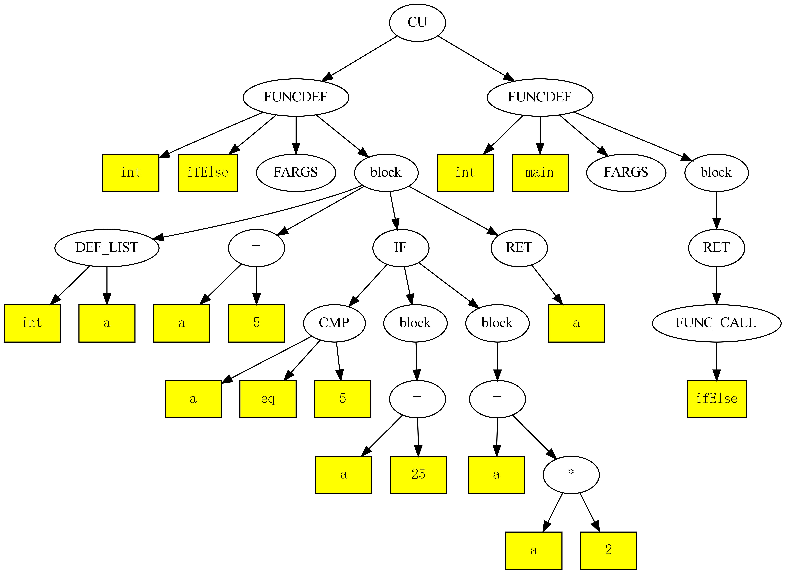

[TOC]


## 前言

这是一个可写进简历的课程作业。

参考:

[南大的编译原理实验课](https://github.com/three-water666/MiniC/)

## 词法分析

### 💠识别Token

词法分析器需要遍历输入的源代码，识别出其中的Token，本项目中使用**Flex**工具进行词法分析。Token是源代码中的最小语法单元，可以是关键字、标识符、运算符、常量等。

🔸 关键字

&emsp;&emsp;MiniC文法里面的关键字有：int , void, if, else, return, break, continue, while, for(后加的)

🔸 标识符

&emsp;&emsp;标识符必须以字母a~z、 A~Z或下划线开头，后面可跟任意个(可为0)字符，这些字符可以是字母、下划线和数字

&emsp;&emsp;标识符最大长度为256

```bash
[a-zA-Z_]([a-zA-Z0-9_])*
```

<div align="center", >

<p >图1 识别标识符</p>
</div>

🔸 运算符

&emsp;&emsp;支持的运算有

&emsp;&emsp;二元运算：+,-,*,/,%

&emsp;&emsp;一元运算: -(取负), ++, --

&emsp;&emsp;逻辑运算: &&, ||, !

&emsp;&emsp;关系运算: >, <, >=, <=, ==, !=

🔸 常量

  🔹 十进制整数

  ```
  [1-9][0-9]*|0
  ```

  🔹 十六进制整数

  ```
  0(x|X)[0-9a-fA-F]+
  ```

  🔹 八进制整数

  ```
  0[0-7]+
  ```

​		由于文法暂不支持浮点数，所以这里就不写浮点数的识别

### 💠屏蔽注释

词法分析器需要屏蔽注释，以便后续的处理程序忽略注释。

MiniC中支持两种注释

```c
// 单行注释

/*
多行注释
*/
```

### 💠跳过空格和换行符

词法分析器需要跳过输入中的空格和换行符，在Token之间建立正确的分隔符。

### 💠错误处理

词法分析器需要处理输入中的错误，并在出现错误时向后续的处理程序报告错误信息。

```c
int main()
{
	int a, b, c;
	a = -1.5;
	return t;
}
```

错误信息

```bash
Line 5: Invalid num 1.5, Only supports integers 
Line 5: syntax error
yyparse failed
```

## 语法分析

### 💡改造后的MiniC文法

高层定义，包括全局变量的定义int a,b;和函数的定义 int main();

```yacas
Input     : program
program   : segment |  program segment
segment   : type def  						// 全局变量或者函数名定义或声明
type      :  T_INT | T_VOID
def       :  ident idtail  					// 全局变量或者函数名定义
idtail    : deflist							// 变量定义,第一个不是数组 int a,b[2],c;
		  | varrdef deflist					// 变量定义,第一个是数组   int a[2],b;
		  | '=' expr deflist                // 变量初始化,int a=1,b;
          | '(' paras ')' functail          // 有参函数定义
          | '('  ')' functail               // 无参函数定义
/* 多个变量定义 */
deflist   : ';' | ',' defdata deflist       // 多个变量定义 int a,b,c;
defdata   : ident							// 单个变量
		  | ident varrdef                   // 数组
		  | ident '=' expr                  // 变量初始化,a=1;
varrdef   : '[' num ']'                     // 数组维度
		  | '[' num ']' varrdef  
/* 参数列表 */
paras     : onepara | onepara ',' paras     // 参数列表
onepara   : type paradata                   // 形参
paradata  : ident | ident paradatatail      // 形参为变量或数组
paradatatail : '[' ']' 
			 | '[' num ']' 
			 | paradatatail '[' num ']' 
```

函数内部语句块

```yacas
functail : blockstat | ';'                         // 语句块
blockstat : '{' subprogram '}' | '{'  '}'          // 子程序或空块
subprogram : onestatement| subprogram onestatement // 多个语句
onestatement : statement | localdef                // 局部变量定义或者语句
localdef    : type defdata deflist                 // 局部变量定义
```

一条语句，包括语句块、表达式语句，if、while、for、break、continue、return和空语句

```yacas
statement   : blockstat      						           // 另一个语句块				
             | expr ';'  									   // 表达式语句
             | T_IF '(' expr ')' statement                     // if语句，没有else
             | T_IF '(' expr ')' statement T_ELSE statement    // if语句，有else
             | T_WHILE '(' expr ')' statement                  // while循环
             | T_FOR '(' expr ';' expr ';'expr ')' statement   // for循环
             | T_BREAK ';'                                     // break语句
             | T_CONTINUE ';' 								   // continue语句
             | T_RETURN expr ';'							   // return语句
             | T_RETURN ';'  								   // void return语句
             | ';' 											   // 空语句
```

表达式语句，需要自己定义优先级

```yacas
expr    : lval '=' expr      // 赋值语句
        | expr T_AND expr    // 逻辑与运算
        | expr T_OR expr     // 逻辑或运算
        | expr '+' expr      // 算数加运算
        | expr '-' expr      // 算数减运算
        | expr '*' expr      // 算数乘运算
        | expr '/' expr      // 算数除运算
        | expr '%' expr      // 取余运算 
        | expr cmp expr		 // 关系比较运算
        | factor             // 一元运算
cmp     : T_CMP
```

一元运算

```yacas
factor  : '-' factor              // 取负运算
        | '!' factor			  // 逻辑非运算
        | lval T_DEC              // 右自减
        | lval T_INC			  // 右自增
        | T_DEC lval              // 左自减
        | T_INC lval			  // 左自增
        | rval                    // 右值
/* 右值 */
rval    : lval					  // 左值
        | '(' expr ')'            // 表达式
        | ident '(' realargs ')'   // 有参函数调用
        | ident '(' ')'           // 无参函数调用
        | num                     // 数字
/* 左值 */
lval    : ident                   // 变量
        | ident lvaltail          // 数组引用
lvaltail    :'[' expr ']'          
            |  lvaltail '[' expr ']'

ident   : T_ID
num     : T_DIGIT
/* 实参 */
realargs    : expr
            | realargs ',' expr 
```

### 💡构建抽象语法树（AST）

语法分析器需要将识别出的语法结构组织成一个抽象语法树（AST），该树表示程序的语法结构。通常，AST是一种高度抽象的表示程序结构的树形结构。这里使用**Bison**工具进行词法分析构建抽象语法树。

### 💡检查语法错误

语法分析器需要检查程序中是否存在语法错误。如果发现语法错误，语法分析器需要报告错误信息并停止编译过程。

### 💡处理优先级和结合性

语法分析器需要考虑不同运算符的优先级和结合性，从而正确地构建AST。


### 💡处理语法糖

语法分析器需要将语法糖转换为等价的代码。语法糖指的是一些语法上的简写形式，可以简化代码，但需要在语法分析阶段进行转换。

### 💡生成代码注释

语法分析器可以生成代码注释，以便程序员在查看生成代码时更容易理解代码的含义。

💡抽象语法树的实现

示例代码

```c
// test if-else
int ifElse() {
  int a;
  a = 5;
  if (a == 5) {
    a = 25;
  } else {
    a = a * 2;
  }
  return (a);
}


int main() {
  return (ifElse());
}
```

<div align="center", >

<p >抽象语法树</p>
</div>

本项目是用的是Flex+Bison套装实现的词法分析和语法分析

抽象语法树的每一个非叶子节点都是一个运算符，AST的结构会直接影响到后序IR的生成。因此，在生成AST的时候应尽可能使树结构简单化，避免产生一些不必要的节点，从而加大后续工作量。

## 语义分析

### 🎓类型检查

语义分析器需要对程序中的表达式和操作进行类型检查，确保相容的类型之间进行正确的操作，避免类型不匹配的错误。

### 🎓符号表管理

语义分析器需要构建符号表，用于记录程序中的变量、函数等符号的信息。符号表可以用于检查变量的重复声明、判断变量的作用域、检查函数的参数匹配等。

符号表里面包含全局变量表和函数表两个重要属性，为了提高查找效率使用哈希表存储

```c++
class SymbolTable {
public:
    // 用来保存所有的全局变量
    std::unordered_map<std::string, Value *> varsMap;
    std::vector<std::string > varsName;
    // 保存函数名，以便顺序遍历
    std::vector<std::string > funcsName;
    // 用来保存所有的函数信息
    std::unordered_map<std::string, FuncSymbol *> funcsMap;
};
```

函数符号本身就是一个符号变量，除了有其他符号的属性外，还有局部变量表、临时变量表、参数列表等函数的属性

还使用了符号栈来管理局部变量的作用域

```c++
class FuncSymbol : public Value {
public:
    // 参数列表
    std::vector<Value *> fargs;
    // 局部变量表
    std::unordered_map<std::string, Value *> localVarsMap;
    std::vector<std::string > localVarsName;
    // 临时变量表
    std::unordered_map<std::string, Value *> tempVarsMap;
    std::vector<std::string > tempVarsName;
    // 局部变量符号栈
    VarStack stack;
    // 产生IR时用的临时符号栈
    VarStack tempStack;
    // 当前作用域
    int currentScope = 0;
};
```

符号栈

```c++
class VarStack {
public:
    int scope = -1;
    std::vector<LocalVarTable *> Stack;
    /// @brief 新增一个作用域
    /// @param varTable 符号表
    void push(LocalVarTable *varTable)
    {
        scope++;
        Stack.push_back(varTable);
    }
    // 离开作用域之后,将符号表出栈
    void pop()
    {
        scope--;
        Stack.pop_back();
    }
    /// @brief 在整个栈里查找某个变量
    /// @param var_nam 变量名
    /// @return 变量Value
    Value *search(std::string var_nam, int currentScope)
    {
        for (int i = currentScope;i > -1;i--) {
            LocalVarTable *varTable = Stack[i];
            Value *var = varTable->find(var_nam);
            if (var != nullptr) {
                return var;
            }
        }
        return nullptr;
    }

    /// @brief 在当前作用域查找变量
    /// @param var_name 变量名
    /// @return 变量Value
    Value *find(std::string var_name, int currentScope)
    {
        return Stack[currentScope]->find(var_name);
    }

    /// @brief 在当前作用域增加变量
    /// @param val 变量Value
    /// @param var_name 变量名
    void addValue(Value *val, std::string var_name, int currentScope)
    {
        Stack[currentScope]->localVarsMap[var_name] = val;
    }
};
```


### 🎓函数调用检查

语义分析器需要检查函数调用的合法性，包括检查函数名、参数个数、参数类型等是否正确。

### 🎓作用域分析

语义分析器需要处理变量和标识符的作用域，确保变量在其作用域内被正确引用和使用。

### 🎓常量折叠

语义分析器可以进行常量折叠优化，将表达式中的常量计算出来，并用计算结果替换表达式。

### 🎓类型推导

语义分析器可以进行类型推导，根据上下文推断变量或表达式的类型，简化程序中类型注解的书写。

### 🎓错误处理

语义分析器需要检测并报告源代码中的语义错误， 如未声明的变量、类型不匹配、函数调用错误等。

## 中间代码生成

### ⌛构建中间表示

中间代码生成器需要根据源代码和语法分析器生成的抽象语法树（AST），构建一种中间表示形式。这种中间表示通常是一种高级语言或类似汇编语言的形式，比源代码更接近目标代码，但相对简化和规范化。

### ⌛表达式转换

中间代码生成器需要将源代码中的各种表达式转换为中间表示形式。这包括算术表达式、逻辑表达式、赋值表达式等。

### ⌛控制流转换

中间代码生成器需要处理分支语句（如if语句、switch语句）和循环语句（如for循环、while循环），将它们转换为中间表示形式。

### ⌛符号表处理

中间代码生成器需要处理符号表，以解析变量和函数的引用、处理作用域等。

### ⌛常量和临时变量处理

中间代码生成器需要处理常量的表示和处理临时变量的生成，以便进行计算和存储。

### ⌛优化

中间代码生成器可以进行一些简单的局部优化，如常量折叠、常量传播等，以改进中间代码的质量和效率。

### ⌛错误处理

中间代码生成器需要检查源代码和语法分析器生成的抽象语法树是否存在不符合语义规则的情况，并报告错误信息。

## 代码优化

### 🔎去除冗余代码

通过识别和删除冗余代码来减少代码的大小和复杂度，提高代码可读性和维护性。

### 🔎减少函数调用

减少函数调用可以减少函数调用的开销和栈帧的创建和销毁等操作。

### 🔎循环优化

对循环结构进行优化，例如展开循环、循环变量初始值的调整等，以提高循环的效率。

### 🔎常数折叠

在编译期间对一些常量表达式进行计算，以减少程序运行时的计算量。

### 🔎变量复用

通过复用已有的变量来减少内存分配和释放的开销，提高程序的效率。

### 🔎数据流分析

对程序的数据流进行分析，以便更好地了解程序的执行过程并优化程序。

### 🔎硬件指令优化

针对特定的硬件指令，对程序进行优化以提高程序性能。

### 🔎并行优化

对多线程、多进程、分布式和GPU编程等内容进行优化，以利用多核处理器和其他并行资源提高程序性能。

## 基本块划分及控制流图

