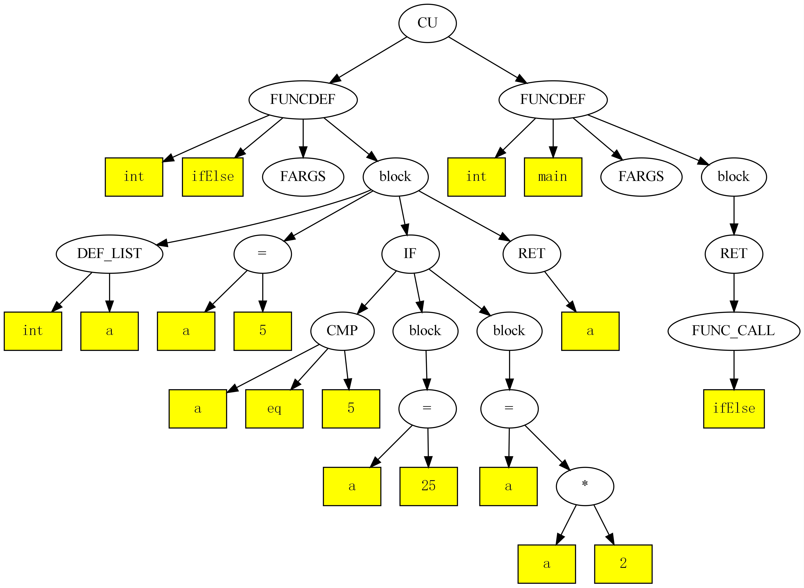
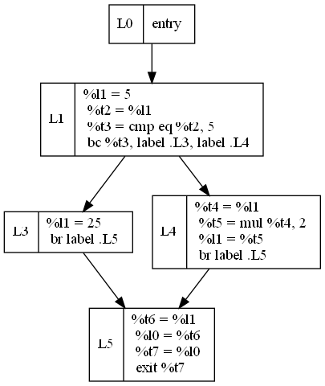

# minic

## 功能

1. 选项-a可产生抽象语法树AST

    cmake-build-debug\minic.exe -a -o test.jpg  test.c

2. 选项-r可产生线性IR

    cmake-build-debug\minic.exe -i -o test.ir  test.c

3. 选项-d可产生控制流图

    cmake-build-debug\minic.exe -d -o test.dot  test.c

    dot test.dot -Tpdf -o test.pdf

    dot test.dot -Tpng -o Blockgraph.png

## 功能示例

1. [028_if_test1.c](./doc/image/028_if_test1_ast.jpg) 抽象语法树

    <div align="center", >
    
    <p >抽象语法树</p>
    </div>

2. [028_if_test1.c](./doc/image/028_if_test1_ast.jpg) 线性ir

    ``` bash
    define i32 @ifElse() {
        declare i32 %l0 ; variable: return
        declare i32 %l1 ; variable: a
        declare i32 %t2
        declare i1 %t3
        declare i32 %t4
        declare i32 %t5
        declare i32 %t6
        declare i32 %t7
        entry
        %l1 = 5
        %t2 = %l1
        %t3 = cmp eq %t2, 5
        bc %t3, label .L3, label .L4
        .L3:
            %l1 = 25
            br label .L5
        .L4:
            %t4 = %l1
            %t5 = mul %t4, 2
            %l1 = %t5
            br label .L5
        .L5:
            %t6 = %l1
            %l0 = %t6
            %t7 = %l0
            exit %t7
    }
    define i32 @main() {
        declare i32 %l0 ; variable: return
        declare i32 %t1
        declare i32 %t2
        entry
        %t1 = call i32 @ifElse()
        %l0 = %t1
        %t2 = %l0
        exit %t2
    }
    ```

3. [028_if_test1.c](./doc/image/028_if_test1_ast.jpg) 控制流图

    <div align="center">
    
    <p>控制流图</p>
    </div>

git config --global --unset http.proxy

git config --golbal http.proxy <http://127.0.0.1:7890>

git commit -m

git push -u origin main

git reset --hard

老师写好的程序运行方式

.\test\IRCompiler\MINGW-x86_64\IRCompiler.exe -S -I -o test.ir0 test.c

## 源代码构成

calculator.l 借助flex工具实现的词法分析器脚本源代码

calculator_lex.cpp 借助flex工具实现的词法分析器自动生成C语言源文件

calculator_lex.h 借助flex工具实现的词法分析器自动生成C语言头文件

calculator.y 借助bison工具实现的语法分析器脚本源代码

calculator_yacc.cpp 借助bison工具实现的语法分析器自动生成C语言源文件

calculator_yacc.h 借助bison工具实现的语法分析器自动生成C语言头文件

expr.cpp 遍历抽象语法树进行表达式运算相关函数

expr.h expr.c对应的头文件

ast.cpp 抽象语法树创建所需要的函数

ast.h ast.cpp对应的头文件

graph.cpp 遍历抽象语法树利用graphviz生成图片

graph.h graph.cpp对应的头文件

symbol.cpp 符号表管理

symbol.h symbol.cpp对应的头文件

genIR.cpp 遍历抽象语法树产生线性IR

IRInst.cpp 线性IR指令类的实现

IRInst.h 线性IR指令类的头文件

IRCode.cpp 线性IR管理类的实现

IRCode.h 线性IR管理类的头文件

main.cpp 计算器程序的主函数

logo.ico 计算器程序的图标

resouce.rc.in Windows系统资源文件，要为GB2312编码或者GBK编码

test.txt 测试用例代码

## 计算器使用方法

### Linux平台

./cmake-build-debug/calculator-flex-bison -a test.txt

./cmake-build-debug/calculator-flex-bison -a -o test.pdf test.txt

./cmake-build-debug/calculator-flex-bison -r test.txt

./cmake-build-debug/calculator-flex-bison -r -o ir.txt test.txt

./cmake-build-debug/calculator-flex-bison -R test.txt

### Windows平台

.\cmake-build-debug\calculator-flex-bison.exe -a test.txt

.\cmake-build-debug\calculator-flex-bison.exe -a -o test.pdf test.txt

.\cmake-build-debug\calculator-flex-bison.exe -r test.txt

.\cmake-build-debug\calculator-flex-bison.exe -r -o ir.txt test.txt

.\cmake-build-debug\calculator-flex-bison.exe -R test.txt

## 工具安装

### flex&bison

#### Windows(MinGW)

pacman -S flex bison

#### Linux(ubuntu)

sudo apt install flex bison

### graphviz

#### Windows(MinGW)

pacman -S pkg-config mingw-w64-x86_64-graphviz

#### Linux(ubuntu)

sudo apt install pkg-config graphviz libgraphviz-dev

## flex与bison的使用方法

### Windows

主要给Visual Studio用

win_flex -o calculator_lex.cpp --wincompat calculator.l

win_bison -o calculator.cpp calculator.y

D:\Project\Compile\CompilerTools\msys64\usr\bin\bison.exe -o calculator.cpp calculator.y

### MinGW、Linux or Mac

flex -o calculator_lex.cpp --header-file=calculator_lex.h calculator.l

bison -o calculator_yacc.cpp --header=calculator_yacc.h -d calculator.y

请注意bison的--header在某些平台上可能是--defines，要根据情况调整指定。

## 计算器强化

在CPU中，整数与实数不能直接进行数学运算，整数靠ALU进行运算，实数靠浮点协处理器或者数学库进行运算，
所以整数需要先转换成实数，然后做实数运算。

因此，对于线性IR指令，必须区分整数运算与实数运算。例如加法，IR指令必须区分为整数加法和实数加法。
还需要追加整数转换为实数的指令，需要时追加实数转整数的指令。
